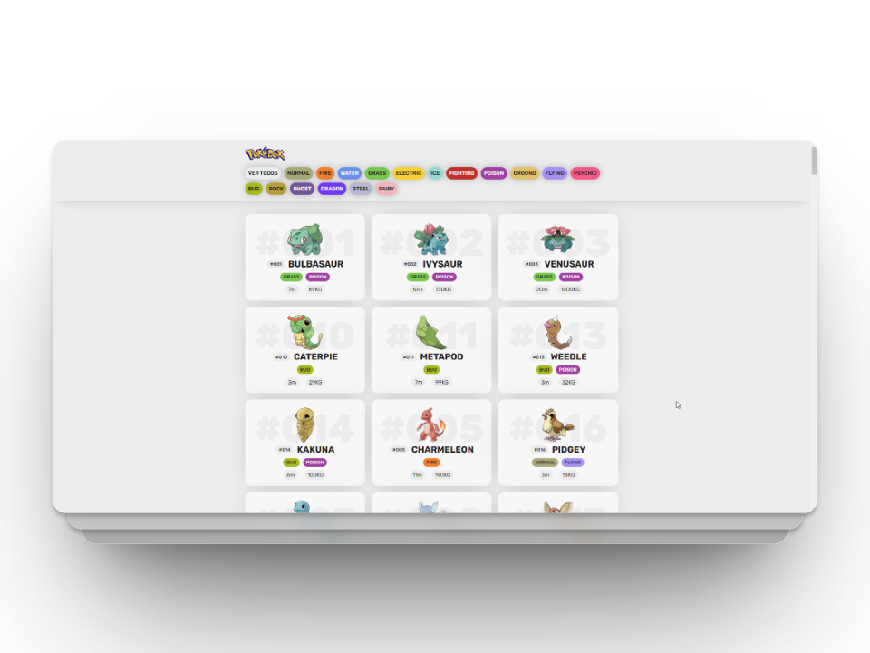

# Pokédex Proyecto

Este es un proyecto de Pokédex utilizando HTML, CSS y JavaScript, que consume la API de [PokéAPI](https://pokeapi.co/). La Pokédex es una enciclopedia virtual que muestra información sobre diferentes Pokémon, clasificados por tipos.


## Funcionalidades

- **Clasificación por tipos:** Puedes presionar botones para seleccionar un tipo de Pokémon (por ejemplo, Agua, Fuego, Planta, etc.) y ver una lista de Pokémon de ese tipo.

- **Información detallada:** La Pokédex proporciona información detallada sobre cada Pokémon, incluyendo su número, nombre, tipo, altura y peso.

## Uso

1. Clona este repositorio en tu máquina local:

   ```bash
   git clone https://github.com/emiliojrb26/Pokedex.git
   ```
